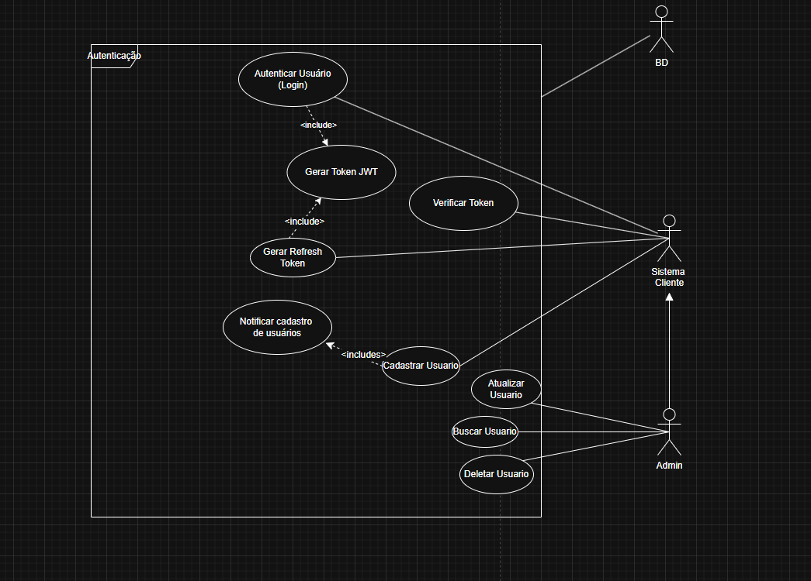
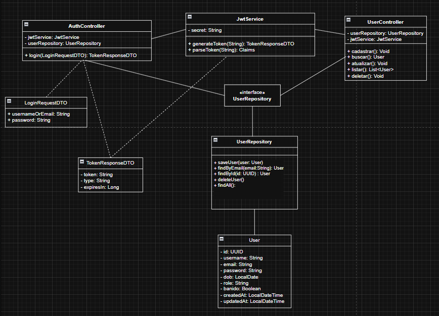

# Casos de uso e diagrama de classes do sistema de autenticação

## Casos de Uso

### Ator -  Cliente
- Autenticar jogador(login)
- Verificar token de acesso
- Gerar refresh token
- Cadastrar jogador

### Ator -  Admin
- Gerenciar jogadores (CRUD)
- Gerenciar tokens - banir jogador
- Gerenciar permissões de acesso

## Diagrama de Classes
- **AuthController**: Responsável por lidar com as requisições de autenticação, como login e verificação de token.

- **UserController**: Responsável por gerenciar as operações relacionadas aos usuários, como cadastro

- **UserRepository (Interface)**: Define o contrato para acesso aos dados dos usuários, permitindo a abstração da camada de persistência.

- **Implementação do Repository**: Responsável por realizar a persistência dos dados e a comunicação com o banco de dados, implementando a interface UserRepository.

- **Entidade User**: Representa o modelo de dados do usuário.

A separação clara de responsabilidades entre os controllers, repositórios e entidades facilita a manutenção e escalabilidade do sistema, além de promover um design mais limpo e organizado.

